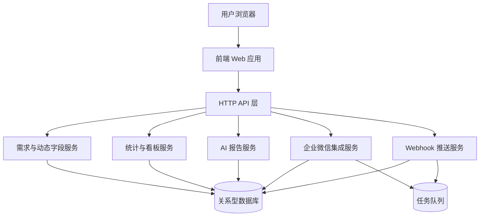
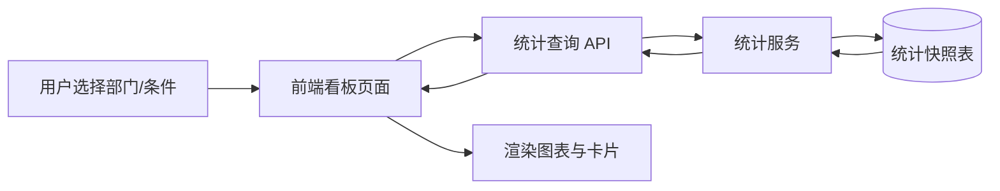
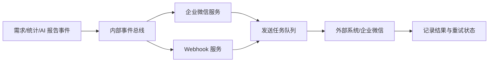

## Product Overview

在现有需求管理系统基础上，补齐围绕“部门动态字段”的统计中台与可视化看板能力，提供自动生成的 AI 月度报告，并打通企业微信消息触达与 Webhook 对外事件推送，使部门与个人能够基于同一套数据视图进行分析、汇报和系统集成。

## Core Features

### 1. 部门动态字段统计与看板

- **字段统计配置中心**  
管理端页面按部门/模板列出动态字段，支持开启统计、选择聚合方式（计数/去重计数/求和/均值等）、设置分组维度（部门/负责人/时间/字段值）与可见范围（全局/部门/个人）。采用表格+侧滑面板编辑，支持搜索、批量配置。
- **部门看板**  
提供按部门维度的多图表看板：数据概览卡片（关键字段指标）、时间趋势图、字段值分布图、部门对比图。支持切换时间范围、按动态字段过滤、保存常用视图。页面布局为顶部筛选区+多行卡片和图表网格。
- **个人看板**  
面向个人负责的需求视角展示同一套指标，突出个人完成量、SLA 达成、关键动态字段表现。采用卡片式概览+列表明细联动，支持从图表下钻到需求明细。
- **权限与视图管理**  
支持按角色/部门控制看板入口与字段可见性，允许用户保存自定义布局与筛选条件，列表中展示“我的视图/共享视图”，可一键应用。

### 2. AI 月度报告（部门/个人）

- **报告生成入口**  
提供部门与个人两个入口，可按自然月/服务月选择时间范围，支持立即生成或定时自动生成。生成状态以列表呈现，含时间范围、对象、生成进度与结果状态。
- **报告详情页**  
左侧为结构化章节导航（本月概览、工作量分析、质量表现、风险与建议等），主区域展示图表摘要和 AI 撰写的文字报告，关键结论以高亮标签和要点列表呈现，可折叠/展开详细分析。
- **导出与发送**  
支持一键导出为文档/PDF（结构化目录+图表截图），并在系统内提供“发送到企业微信”入口，发送后在页面显示发送记录与状态。
- **报告归档与检索**  
提供按部门/个人维度的报告列表，支持按时间、关键字检索，并可快速对比相邻月份报告的核心指标变化。

### 3. 企业微信绑定与通知

- **账号绑定流程**  
在个人设置页面提供“绑定企业微信”入口，通过扫码授权完成后展示绑定状态、企业微信姓名与解绑按钮，状态区域采用醒目成功/失败提示样式。
- **通知订阅设置**  
在通知设置页以分组开关形式配置事件订阅：需求事件（创建/状态变更/指派）、SLA 提醒（即将超时/已超时）、AI 月报生成完成等。每个事件有简要说明和示例消息预览。
- **消息展示形态**  
设计标准化消息模版：标题（事件类型+需求标题/报告名称）、关键信息（部门、负责人、截止时间、状态）、快捷链接按钮（查看需求/查看报告/进入看板），保证在企微中结构清晰、一键跳转回系统。

### 4. Webhook 对外集成

- **Webhook 订阅配置页**  
系统管理端提供 Webhook 列表，可新增/编辑订阅：配置回调 URL、订阅事件类型（需求创建/变更、统计阈值触发、AI 月报生成等）、签名秘钥、重试策略（次数、间隔、超时）。表单采用分步或分组卡片布局，重要字段有校验提示。
- **事件推送与日志**  
提供推送日志页面，列表展示最近事件推送记录：事件类型、目标 URL、状态（成功/失败/重试中）、重试次数、最后推送时间。支持展开查看请求头、请求体与响应摘要，并提供“手动重试”按钮。
- **阈值与规则可视化**  
对统计阈值触发类事件，在配置界面通过简单表单/标签展示规则（如某字段指标超过/低于阈值时触发），并标记当前规则是否生效，方便外部系统理解将收到的事件类型。

## Tech Stack

- 前端：React + TypeScript 单页应用，组件库采用企业级设计体系，图表使用可配置图表库。
- 后端：Node.js + TypeScript，采用分层单体架构（Controller / Service / Repository），提供 RESTful API。
- 数据库：关系型数据库（如 PostgreSQL/MySQL），存储需求数据、动态字段配置、统计快照、AI 报告、Webhook 与通知配置。
- 异步任务：任务队列用于统计计算、AI 报告生成、Webhook 重试与企微消息发送。
- 鉴权与权限：基于现有用户体系扩展角色/部门/字段级可见性控制。

## System Architecture

采用分层单体后端 + 前后端分离架构，后端内部按领域模块划分服务层，前端单页应用通过统一 API 网关访问各模块。



## Module Division

1. **需求与动态字段服务模块**

- 职责：管理需求主体数据、部门动态字段模板及字段值。
- 依赖：数据库、权限模块。
- 接口：字段模板查询、字段值读写、按部门/时间拉取原始需求数据。

2. **统计与看板服务模块**

- 职责：字段级统计配置、统计任务执行、统计快照存储、看板数据查询。
- 依赖：需求与动态字段服务、数据库、任务队列。
- 接口：统计配置 CRUD、触发/定时统计、看板数据查询 API。

3. **AI 报告服务模块**

- 职责：基于统计中间层数据生成结构化报告，管理报告模板与归档。
- 依赖：统计服务、数据库、任务队列、AI 模型调用。
- 接口：报告生成任务提交、报告内容查询、导出数据结构。

4. **企业微信集成服务模块**

- 职责：用户 OAuth 绑定、消息推送、通知订阅管理。
- 依赖：用户系统、数据库、任务队列。
- 接口：绑定/解绑、通知设置 CRUD、发送企微消息。

5. **Webhook 服务模块**

- 职责：Webhook 订阅管理、事件入队、签名生成与重试策略执行、推送日志记录。
- 依赖：数据库、任务队列。
- 接口：订阅配置 CRUD、事件推送、推送日志查询、手动重试。

## Data Flow

### 1. 看板数据查询流程



### 2. 事件驱动的通知与 Webhook 流程



## Core Directory Structure

```
project-root/
├── frontend/
│   ├── src/
│   │   ├── pages/              # 看板、报告、设置等页面
│   │   ├── components/         # 通用卡片、图表、表格组件
│   │   ├── features/
│   │   │   ├── stats/          # 动态字段统计配置与看板
│   │   │   ├── ai-report/      # AI 月报
│   │   │   ├── wecom/          # 企业微信绑定与通知
│   │   │   └── webhook/        # Webhook 配置与日志
│   │   ├── services/           # 调用后端 API
│   │   ├── store/              # 全局状态管理
│   │   └── utils/
│   └── public/
└── backend/
    ├── src/
    │   ├── modules/
    │   │   ├── core/
    │   │   ├── stats/
    │   │   ├── ai-report/
    │   │   ├── wecom/
    │   │   └── webhook/
    │   ├── common/
    │   └── main.ts
    └── package.json
```

## Key Code Structures

### 数据模型（示例）

```typescript
// 动态字段配置
interface DynamicFieldDefinition {
  id: string;
  deptId: string;
  templateId: string;
  name: string;
  key: string;
  type: 'number' | 'string' | 'enum' | 'date' | 'boolean';
}

// 统计配置
interface FieldStatConfig {
  id: string;
  fieldId: string;
  enabled: boolean;
  aggType: 'count' | 'distinctCount' | 'sum' | 'avg';
  groupBy: ('dept' | 'owner' | 'month' | 'fieldValue')[];
  visibility: 'global' | 'dept' | 'personal';
}

// 统计快照
interface StatSnapshot {
  id: string;
  periodType: 'calendar_month' | 'service_month';
  periodStart: string;
  periodEnd: string;
  deptId?: string;
  userId?: string;
  metrics: Record&lt;string, number&gt;;
}

// AI 报告
interface AiReport {
  id: string;
  type: 'dept' | 'user';
  targetId: string;
  periodStart: string;
  periodEnd: string;
  structure: any; // 结构化章节数据
  content: string; // 富文本/Markdown
  status: 'pending' | 'generating' | 'success' | 'failed';
}

// Webhook 订阅
interface WebhookSubscription {
  id: string;
  name: string;
  url: string;
  events: string[];
  secret: string;
  retryTimes: number;
  retryIntervalSec: number;
  enabled: boolean;
}
```

### API Endpoints（示例）

- `/api/stats/config`：GET/POST/PUT/DELETE 动态字段统计配置
- `/api/stats/dashboard`：GET 部门/个人看板数据
- `/api/ai-reports`：GET 报告列表，POST 触发生成
- `/api/ai-reports/:id`：GET 报告详情，GET 导出数据
- `/api/wecom/bind`：GET 跳转/回调，DELETE 解绑
- `/api/wecom/settings`：GET/PUT 通知订阅
- `/api/webhooks/subscriptions`：GET/POST/PUT/DELETE 订阅管理
- `/api/webhooks/logs`：GET 推送日志，POST `/:id/retry` 手动重试

### State Management

- 前端使用全局状态管理库管理用户信息、当前部门/视图、AI 报告列表缓存等，统计与看板数据通过数据请求库按查询条件缓存与自动刷新。
- 关键筛选条件（时间、部门、字段筛选器）放入 URL 查询参数以支持分享链接。

## Technical Implementation Plan

1. **动态字段统计与看板**

- 问题：需要在动态字段基础上进行字段级统计并高性能展示。
- 方案：引入统计配置表与统计快照表，周期性或按需生成快照；看板查询只读快照。
- 步骤：  
1）设计统计配置与快照数据表；
2）实现配置管理 API 和前端页面；
3）实现统计任务（聚合、按部门/个人分组）；
4）开发看板查询 API 与前端图表；
5）增加权限控制与视图保存。
- 难点：统计性能与灵活性，需通过索引、分批计算与异步任务优化。

2. **AI 月度报告**

- 问题：基于统计结果自动生成结构化月报。
- 方案：AI 服务从统计快照读取指标，按模板构造 Prompt，生成结构化 JSON+自然语言正文。
- 步骤：  
1）定义报告结构与存储模型；
2）实现生成任务队列消费者；
3）封装 AI 调用与错误重试；
4）开发报告列表与详情、导出 API；
5）接入企微发送入口。
- 难点：输出稳定性与可控性，使用模板化提示和字段约束。

3. **企业微信绑定与通知**

- 问题：建立系统用户与企微用户映射，并可靠推送消息。
- 方案：实现 OAuth 流程存储 userId–wecomUserId 映射，订阅配置表控制不同事件的消息发送。
- 步骤：  
1）接入企微 OAuth 回调与绑定接口；
2）建设通知订阅模型与配置界面；
3）实现统一通知服务，从内部事件总线消费并发送消息；
4）在需求/SLA/AI 报告流程中发布事件。
- 难点：避免重复推送和失败重试风暴，可限制重试次数并记录状态。

4. **Webhook 对外集成**

- 问题：将关键事件可靠推送给外部系统。
- 方案：Webhook 订阅配置+事件队列+签名验证+重试与日志管理。
- 步骤：  
1）设计订阅/事件/日志表结构；
2）实现订阅管理 API 和 UI；
3）从内部事件总线消费并入队；
4）实现签名、推送、重试逻辑；
5）开发推送日志查询与手动重试功能。
- 难点：保证幂等性与安全性，通过事件 ID、签名与 IP 控制解决。

5. **权限与审计**

- 扩展现有权限模型实现字段可见性、部门/个人看板访问控制。
- 增加关键配置（统计、Webhook）的操作日志，以便审计与问题定位。

## Integration Points

- **企业微信**  
- 使用 OAuth2 流程获取并存储企微用户 ID。  
- 消息发送采用官方消息接口，消息体为 JSON，包含跳转链接与关键字段摘要。

- **Webhook 外部系统**  
- 推送内容采用 JSON，包含事件类型、事件时间、资源标识、摘要数据、签名。  
- 签名通过共享秘钥及时间戳生成，外部系统可按文档验证。

## Performance Optimization

- 为需求数据、动态字段值与统计快照建立合适索引；大表查询采用分页和时间范围限制。
- 统计与 AI 报告生成均通过异步任务执行，避免阻塞在线请求。
- 前端看板图表采用懒加载与数据缓存，减少重复请求。

## Security Measures

- 所有外部输入（包括 Webhook URL、AI Prompt 参数）进行严格校验与清洗。
- Webhook 使用签名验证与 HTTPS 强制传输；敏感配置加密存储。
- 权限控制贯穿统计配置、看板访问与报告查看，防止跨部门越权。

## Scalability

- 后端模块化拆分清晰，Webhook 推送与 AI 报告生成可独立扩容为多实例消费者。
- 统计快照设计可按部门/时间分片，支持未来数据量增长。

## Development Workflow

- 使用分支开发与代码审查流程，按模块划分迭代（统计看板 → AI 报告 → 企微通知 → Webhook）。
- 编写单元测试覆盖统计逻辑、AI 生成流程与安全校验；关键流程增加集成测试。
- 提供灰度发布能力，对部分部门先行启用新看板和月报功能，观察效果后全量开放。

## 整体设计风格

采用偏深色的企业级数据看板风格，结合 Material 与 Glassmorphism。主界面以深色渐变背景和半透明卡片承载复杂图表，配合亮色高饱和点缀色突出关键指标。布局上强调信息分区与层级，顶部为全局导航与筛选，中部为图表与卡片网格，底部为操作与状态提示。

响应式布局适配常见桌面宽度，核心图表区在宽屏下呈 3 列网格，在窄屏下自动收缩为 1–2 列，并保持筛选器与操作按钮始终可见。交互上注重悬浮提示、平滑切换和视图保存反馈，确保频繁操作流畅可控。

### 页面规划

1. **部门动态字段统计配置页**

- 顶部导航条：系统 Logo、模块切换（需求、看板、报告、集成）、全局搜索与用户菜单。
- 部门与模板筛选条：位于导航下方，采用下拉+标签形式，支持快速切换部门和动态字段模板。
- 字段配置表格区：宽屏表格展示字段名称、类型、统计开关、聚合方式、分组维度、可见范围等，行内带开关与标签。
- 侧滑配置面板：点击字段进入右侧浮层，分组展示统计选项与预览示例。
- 底部操作条：显示批量启用/禁用按钮与配置保存状态。

2. **部门/个人看板页**

- 顶部导航条：与全局一致，当前高亮“看板”模块。
- 看板筛选区：包含部门/个人切换、时间范围选择器、动态字段过滤器与视图选择（我的视图/共享视图）。
- 指标概览卡片区：一行 3–4 个半透明卡片，显示本期累计、环比、目标达成率等，配图标与环形进度。
- 图表网格区：多行图表（趋势折线、对比柱状、分布饼图等），悬浮显示详细数值与相关字段说明。
- 下钻明细列表：位于页面下方，随图表筛选同步展示需求列表，支持导出当前筛选结果。

3. **AI 月度报告列表页**

- 顶部导航条：高亮“报告”模块，右侧有“生成报告”主按钮。
- 筛选与视图切换区：选择部门/个人、时间范围、自然月/服务月视图，支持“仅看失败/未生成”过滤。
- 报告列表卡片区：每个卡片显示报告对象、时间范围、关键指标摘要、生成状态与操作按钮（查看/导出/发送企微）。
- 生成状态时间轴：页面右侧显示最近一次批量生成状态，按时间轴展示成功/失败与原因。
- 底部分页与批量操作：支持对选中报告批量重新生成或批量发送到企微。

4. **AI 月度报告详情页**

- 顶部标题栏：显示报告对象、时间范围、生成时间与状态标识，提供导出和发送按钮。
- 左侧章节导航栏：垂直列出章节（本月概览/工作量/质量/风险与建议等），支持点击平滑滚动定位。
- 主内容区：上方为关键图表（趋势、对比），下方为 AI 文本报告，采用分节标题+要点列表+高亮标签展示重点。
- 侧边洞察卡片：右侧浮动卡片展示 AI 关键洞察、风险提醒和建议行动项，可一键复制或转为任务。
- 评论与确认区：底部支持评论与“报告已确认”标记，用于团队协作。

5. **企业微信绑定与通知设置页**

- 顶部导航条：位于“设置/通知”模块下。
- 绑定状态卡片：居中大卡片展示当前绑定状态、企微个人信息与扫码绑定/解绑按钮，配动态图标。
- 通知订阅分组区：以分组开关列表展示事件类目（需求事件、SLA、AI 报告），每项含开关、频率说明与示例消息预览。
- 示例消息预览区：右侧手机框 Mock 展示实际企微消息样式，随配置动态更新。
- 底部保存与测试区：提供“保存设置”和“发送测试消息”按钮，保存后顶部出现轻量提示条。

6. **Webhook 配置与日志页**

- 顶部导航条：属于“集成”模块。
- Webhook 列表区：表格列出名称、目标 URL、订阅事件数、启用状态、最近推送结果，支持快速启用/禁用。
- Webhook 详情配置面板：点击进入详情页或侧滑层，分区配置基础信息、事件类型、多选标签、签名秘钥、重试策略与 IP 白名单说明。
- 推送日志与分析区：下方或二级 Tab 展示日志列表与统计图（成功率、耗时分布），支持筛选与展开查看请求/响应详情。
- 操作工具栏：提供手动重试所选记录、一键复制签名示例代码等工具按钮。