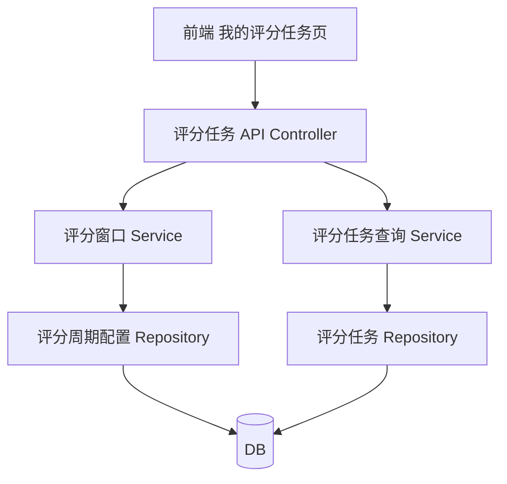
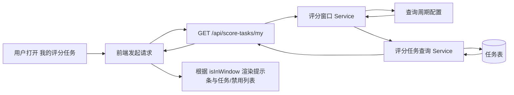

## Product Overview

围绕“我的评分任务”入口，基于评分周期配置与默认评分窗口，控制任务开放、提示与任务列表展示/禁用状态，保证在有配置与无配置场景下前后端行为一致。

## Core Features

- **评分窗口判定逻辑**
- 有周期配置时，仅以配置的评分窗口作为任务可评分时间依据。
- 无周期配置时，默认窗口为“服务月最后一天 00:00 至次月 5 日 23:59”。
- 删除自定义周期后自动回退到默认窗口规则，而不是整月自然月。

- **我的评分任务页列表展示**
- 当前时间在任一评分窗口内：展示该窗口对应服务月的可评分任务列表，支持筛选、排序、状态标记等既有交互。
- 当前时间不在任何评分窗口内：默认不展示当月任务列表，仅显示“暂无可评分任务+下次窗口时间”提示区。

- **窗口外任务禁用展示**
- 在顶部提示区提供“查看即将开启任务”的展开入口。
- 展开后展示该服务月的任务列表，整体为禁用态：卡片灰度、按钮禁用、Hover 提示“将在窗口内开放评分”等。
- 支持收起/展开切换，保持与正常列表一致的结构与信息密度。

- **顶部提示条统一样式**
- 在窗口内：可选展示“评分窗口进行中（起止时间）”的绿色信息条。
- 在窗口外：展示“当前暂无可评分任务 + 下次评分窗口时间”黄色信息条，并附带“查看即将开启任务”链接。
- 提示条固定在列表上方，随页面滚动保持可见或采用轻微阴影区隔主体内容。

## Tech Stack

- 后端：Node.js + Express（TypeScript）
- 数据存储：关系型数据库（评分周期配置表、评分任务表）
- 接口通信：JSON（RESTful）

## 系统架构

采用分层单体架构：Controller 层负责 HTTP 接入，Service 层封装评分窗口与任务查询逻辑，Repository 层访问数据库。



## 模块划分

- **评分周期配置模块**
- 职责：读写评分周期与评分窗口配置；提供按服务月、组织等维度查询。
- 依赖：数据库访问层。
- 接口：`getCycleConfig(serviceMonth, orgId)`、`deleteCycleConfig(id)`。

- **评分窗口 Service**
- 职责：根据当前时间、周期配置计算“当前窗口/下一窗口”；无配置时生成默认窗口。
- 依赖：评分周期配置模块。
- 接口：`getActiveWindow(now, serviceMonth)`、`getNextWindow(now, serviceMonth)`。

- **评分任务查询 Service**
- 职责：在给定窗口内查询用户可评分任务及即将开启任务。
- 依赖：评分窗口 Service、评分任务 Repository。
- 接口：`getMyTasks(userId, serviceMonth, now)` 返回在窗/窗外任务分组。

- **评分任务 API Controller**
- 职责：对接前端“我的评分任务”页面；封装统一返回模型。
- 接口：
    - `GET /api/score-tasks/my?serviceMonth=YYYY-MM`  
返回：`{ isInWindow, currentWindow, nextWindow, enabledTasks, disabledUpcomingTasks }`
    - `DELETE /api/score-periods/:id`  
触发删除后按默认窗口生效。

## 数据流



## 核心目录结构（后端）

```
backend/
├── src/
│   ├── controllers/
│   │   └── scoreTasks.controller.ts
│   ├── services/
│   │   ├── scoreWindow.service.ts
│   │   └── scoreTask.service.ts
│   ├── repositories/
│   │   ├── scoreCycle.repo.ts
│   │   └── scoreTask.repo.ts
│   ├── models/
│   │   └── scoreWindow.ts
│   └── utils/
│       └── dateRange.ts
└── tests/
```

## 核心数据结构与接口

```typescript
interface ScoreWindow {
  start: Date;
  end: Date;
  serviceMonth: string; // YYYY-MM
}

interface ScoreTask {
  id: string;
  title: string;
  subjectName: string;
  status: 'pending' | 'completed';
}

class ScoreWindowService {
  getActiveWindow(now: Date, serviceMonth: string): ScoreWindow | null {}
  getNextWindow(now: Date, serviceMonth: string): ScoreWindow | null {}
  getDefaultWindow(serviceMonth: string): ScoreWindow {}
}
```

## 技术实现要点

1. **默认窗口生成**

- 问题：无配置时需按“服务月最后一天至次月 5 日”生成窗口。
- 方案：工具函数计算服务月最后一天和次月 5 日边界，并统一使用 UTC 或业务时区。

2. **统一返回模型**

- 问题：前端需根据同一接口判断窗口内外与禁用展示。
- 方案：在 `GET /api/score-tasks/my` 中增加 `isInWindow`、`currentWindow`、`nextWindow`、`enabledTasks`、`disabledUpcomingTasks` 字段。

3. **删除配置回退逻辑**

- 问题：删除自定义周期后仍按整月开放的历史行为需修正。
- 方案：删除后不保留任何残余标记，后续所有查询自动走默认窗口逻辑。

4. **异常与边界处理**

- 无任务、无下一窗口、跨年服务月等场景返回空集合与 `null`，前端据此显示文案。

## 设计整体风格

- **风格**：企业级 Material Design + 轻微 Glassmorphism，强调信息密度与清晰层级。
- **布局**：典型三层结构——顶栏导航、主内容区（提示条 + 列表）、底部操作栏。
- **氛围**：稳重蓝灰为主，评分窗口相关信息用高饱和色点亮，营造“时间窗口”紧迫感。
- **动效**：顶部提示条淡入；禁用任务列表展开/收起有高度过渡；按钮 Hover 有轻微阴影和颜色渐变。

### 页面 1：我的评分任务

- **顶部导航栏**  
左侧产品 Logo + 标题“我的评分任务”，右侧服务月选择器与用户信息；背景半透明蓝色，底部投影突出层级。

- **评分窗口提示区**  
位于内容顶部，全宽卡片。
- 窗口内：绿色渐变背景 + 图标，文案“评分窗口进行中：xx-xx”。  
- 窗口外：琥珀色渐变背景，文案“当前暂无可评分任务，下次窗口：xx-xx”，右侧“查看即将开启任务”文字按钮。

- **任务列表区（窗口内）**  
卡片式列表，两列或一列自适应。每条任务展示对象、周期、状态标签，操作按钮“去评分”。行间留白适中，行 Hover 提升阴影。

- **禁用任务列表区（窗口外展开）**  
结构与正常列表一致，但整体灰度+透明度降低；“去评分”按钮为禁用态，并在 Hover 时显示气泡提示“待评分窗口开启后可操作”。

- **底部导航栏**  
横向菜单：主页、我的评分任务、报表等；当前页面以主色高亮，底部带细线分隔内容。

### 页面 2：评分周期配置管理

- 顶栏沿用统一样式，标题为“评分周期配置”。
- 主区为表格：服务月、窗口起止时间、来源（自定义/默认）、状态、操作列（编辑、删除）。
- 删除操作触发居中弹窗，提示删除后回退默认窗口的行为说明。

## Agent Extensions

- **subagent: code-explorer**
- Purpose: 在现有仓库中定位评分周期、评分任务相关代码与接口，评估影响范围。
- Expected outcome: 找到需改造的 Controller/Service/前端页面文件路径，为按模块实施改造提供依据。

- **mcp: Figma**
- Purpose: 为“我的评分任务”和“评分周期配置”页面绘制高保真原型并迭代交互细节。
- Expected outcome: 产出一套经确认的页面设计稿（含窗口内/外状态、禁用列表样式）。

- **mcp: chrome-devtools**
- Purpose: 在浏览器中联调并验证窗口判定与任务展示逻辑，观察实际渲染和状态切换。
- Expected outcome: 完成前后端联调，通过控制当前时间等手段确认各场景展示正确无误。