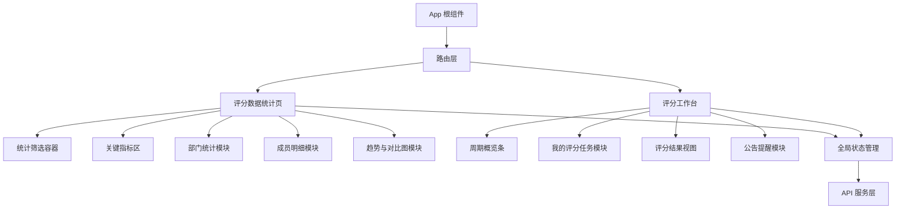
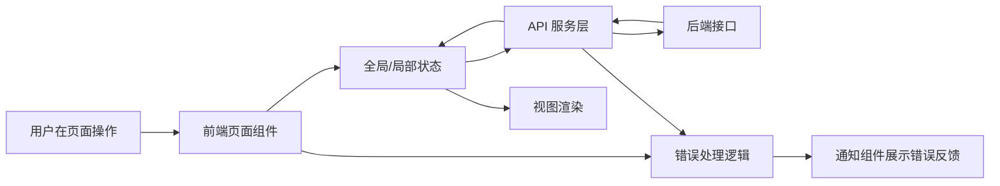

## Product Overview

面向评分业务的「数据统计页 + 工作台」终局形态方案：提供围绕评分周期、统计周期和统计范围的统一入口、任务视图与多维数据统计展示，并在内部标注 Phase 1 / Phase 2 的实现优先级与迭代顺序。

## Core Features

### 一、评分数据统计页（最终形态）

- **全局筛选与联动控制区（Phase 1）**  
顶部横向筛选条，包含评分周期、统计周期、统计范围（全公司/部门/个人）、统计维度等；切换条件时，下方指标卡、表格和图表整体联动刷新，视觉为浅背景+描边标签，固定在页面顶部。

- **关键评分指标总览区（Phase 1）**  
位于筛选区下方，展示平均评分、完成率、参与人数、未完成任务数等核心指标卡，可按当前筛选范围显示环比/同比小标签与趋势箭头。卡片采用分栏布局，配迷你折线/柱状小图和简洁图标。

- **部门维度统计与排行区（Phase 1）**  
中部区域以「表格 + 条形排行榜」组合展现部门平均分、完成率、任务数等，支持按任意指标排序、展开子部门和点击跳转部门详情视图。视觉为左右联排布局，表格 hover 高亮时联动右侧对应条形图柱条。

- **成员明细与任务下钻区（Phase 2）**  
提供成员维度列表，展示成员平均分、完成率、参与周期数等，支持搜索与多条件筛选；点击成员行打开右侧侧滑面板查看其评分任务列表与分数分布图。页面采用可分页表格，侧滑面板占右侧固定宽度。

- **趋势与对比图表区（Phase 2）**  
底部区域提供按时间的评分趋势图、多个评分周期的对比图，以及部门间对比分布图，可通过 Tab 切换不同图表视图，图例支持点击显隐系列，hover 显示数据点详情。整体为深色图表背景、柔和色彩曲线与适度网格线。

- **导出与共享区（Phase 2）**  
页面右上角提供导出当前筛选条件下统计结果的入口，支持导出数据表和指标概览为文件，或生成可分享的统计链接。采用主色按钮 + 下拉菜单形式，与筛选区对齐，悬浮时呈现轻微阴影与颜色变化。

### 二、评分工作台（最终形态）

- **顶部评分周期概览区（Phase 1）**  
顶部以横向周期卡片展示最近多个评分周期，每张卡片包含服务月、周期名称、状态标签（未开始/进行中/已结束），当前周期高亮显示，可横向滑动查看更多周期。当前选中周期驱动下方「我的评分任务」联动刷新。

- **「我的评分任务」主视图区（Phase 1）**  
中间主体区域按所选评分周期聚合展示当前用户的所有评分任务，按状态分组显示（待评分、进行中、已完成），每条任务卡包括被评对象、角色、截止时间、进度条和主操作按钮。支持状态筛选、关键字搜索与列表分页。

- **快捷操作与入口区（Phase 1）**  
在任务列表上方提供「去评分」主按钮、「查看结果」次按钮，以及进入「全部任务」「历史评分记录」的入口。支持一键按当前过滤条件批量进入评分列表。按钮采用主次分级设计，悬浮具备微动效。

- **评分结果与历史周期视图（Phase 2）**  
通过页签在「我的任务」与「我的结果」之间切换，「我的结果」按评分周期与服务月分组展示已完成评分记录，可查看单条评分详情与合计分布；支持按被评对象、周期筛选，支持结果导出。

- **公告与提醒信息模块区（Phase 2）**  
页面右侧或下方预留卡片区域，展示公告、重要提醒、系统更新信息等，可点击跳转相关页面。模块支持折叠收起，保持工作台核心区域简洁。

- **全局导航与状态反馈区（Phase 1）**  
所有页面统一顶部导航条展示系统名称、当前位置与必要的全局操作；底部统一状态/快捷导航条可承载返回顶部、帮助入口等。操作结果以右上角气泡提示或顶部条幅提示反馈成功、失败或警告状态。

## 技术栈（前端侧）

- 前端框架：基于组件化单页应用实现（示例：React + TypeScript）
- UI 组件：企业级组件库，支持表格、布局、抽屉、标签等复杂组件（示例：tdesign React）
- 图表能力：专业图表库支持折线、柱状、饼图与交互（示例：ECharts）
- 状态管理：组合使用路由状态、全局上下文与请求缓存（示例：React Router + React Query）
- 数据交互：通过 REST/GraphQL 接口获取统计数据与任务数据，本方案聚焦前端实现，后端沿用既有服务

---

## 系统架构

采用前端单体应用 + 组件分层架构，按照「页面级容器组件 → 业务组件 → 通用组件 → 服务层」划分，统计页与工作台共用筛选组件、图表组件与表格组件，通过统一的状态管理和 API 服务实现联动。



---

## 模块划分

### 1. 评分数据统计页模块（statistics-page）

- 职责：承载统计筛选、指标卡、部门/成员表格与图表展示。
- 依赖：共享筛选组件、图表组件、API 服务、全局状态。
- 暴露：`StatisticsPage` 页面组件；内部导出子组件供复用（如 KPI 卡片）。

### 2. 评分工作台模块（workbench-page）

- 职责：展示评分周期概览、「我的评分任务」、结果视图与公告模块。
- 依赖：共享周期组件、任务列表组件、API 服务、全局状态。
- 暴露：`WorkbenchPage` 页面组件；任务卡片、周期卡等业务组件。

### 3. 共享组件模块（shared-components）

- 职责：通用筛选条、周期选择器、指标卡、表格封装、图表封装、通知/消息组件。
- 依赖：UI 组件库与图表库。
- 暴露：`FilterBar`, `KpiCard`, `DataTable`, `ChartPanel`, `NotificationToast` 等组件。

### 4. API 服务模块（services/api）

- 职责：封装评分周期、评分任务、统计指标、部门/成员统计等接口请求与数据转换。
- 依赖：HTTP 客户端库。
- 暴露：`fetchCycles`, `fetchMyTasks`, `fetchStatOverview`, `fetchDeptStats`, `fetchMemberStats` 等函数，统一返回结构化数据。

### 5. 状态管理模块（state）

- 职责：管理当前评分周期、统计周期、统计范围、当前用户信息以及接口缓存状态。
- 依赖：路由与请求库。
- 暴露：`useGlobalFilters`, `useCurrentCycle`, `useStatQueries` 等 Hook 或 Store 接口。

---

## 数据流



- 用户在筛选条、周期卡、任务列表执行操作；
- 页面组件更新状态模块中的筛选条件或当前周期；
- 状态模块触发 API 服务请求数据；
- 服务层将后端返回 JSON 转换为前端模型结构；
- 状态变更驱动 KPI 卡、表格、图表与任务视图联动渲染；
- 异常通过统一错误处理逻辑触发通知组件显示错误信息。

---

## 目录结构（前端）

```text
iwish-score/
├── src/
│   ├── pages/
│   │   ├── StatisticsPage/
│   │   │   ├── index.tsx
│   │   │   ├── StatKpiSection.tsx
│   │   │   ├── DeptSection.tsx
│   │   │   ├── MemberSection.tsx
│   │   │   └── ChartsSection.tsx
│   │   └── WorkbenchPage/
│   │       ├── index.tsx
│   │       ├── CycleStrip.tsx
│   │       ├── MyTasksSection.tsx
│   │       ├── ResultsSection.tsx
│   │       └── InfoWidgets.tsx
│   ├── components/
│   │   ├── FilterBar/
│   │   ├── KpiCard/
│   │   ├── DataTable/
│   │   ├── ChartPanel/
│   │   └── Notification/
│   ├── services/
│   │   └── api/
│   ├── state/
│   ├── utils/
│   └── types/
└── package.json
```

---

## 核心数据模型与服务示意

```typescript
// 评分周期
export interface ScoreCycle {
  id: string;
  name: string;
  serviceMonth: string; // 服务月
  status: 'not_started' | 'ongoing' | 'ended';
  startDate: string;
  endDate: string;
}

// 我的评分任务
export interface ScoreTask {
  id: string;
  cycleId: string;
  targetName: string;
  targetDept: string;
  role: string;
  dueAt: string;
  status: 'todo' | 'in_progress' | 'done' | 'expired';
  progress: number; // 完成进度
}

// 统计指标
export interface StatOverview {
  avgScore: number;
  completionRate: number;
  participantCount: number;
  pendingTaskCount: number;
  trend?: number; // 环比变化
}

// 部门统计
export interface DeptStat {
  deptId: string;
  deptName: string;
  avgScore: number;
  completionRate: number;
  taskCount: number;
  children?: DeptStat[];
}

// API 服务示例
class ScoreApi {
  async fetchCycles(): Promise&lt;ScoreCycle[]&gt; { /* ... */ }
  async fetchMyTasks(cycleId: string): Promise&lt;ScoreTask[]&gt; { /* ... */ }
  async fetchStatOverview(params: any): Promise&lt;StatOverview&gt; { /* ... */ }
  async fetchDeptStats(params: any): Promise&lt;DeptStat[]&gt; { /* ... */ }
}
```

---

## 技术实现要点与计划

### 1. 全局筛选与联动

- **问题**：保证统计页各区域与工作台视图之间对同一周期/范围的一致联动。
- **方案**：构建统一的全局筛选状态（当前周期、统计周期、统计范围），通过 Hook 或 Store 提供读写接口，页面订阅该状态。
- **实现步骤**：  
1）定义全局筛选状态结构与更新方法；
2）实现通用 `FilterBar` 组件；
3）统计页、工作台接入筛选状态并联动请求；
4）将路由参数与筛选状态打通，实现可分享链接；
5）补充状态变更的加载与错误反馈逻辑。
- **挑战与对策**：状态与路由可能不一致，需统一以路由为单一事实来源，并在初始化时同步。

### 2. 统计页指标卡与表格/图表

- **问题**：在保证性能的前提下呈现复杂表格与多图表联动。
- **方案**：封装 KPI 卡组件、图表容器组件；表格使用分页与虚拟滚动；图表延迟加载与按需渲染。
- **实现步骤**：  
1）实现可配置的 `KpiCard`、`DataTable`、`ChartPanel` 通用组件；
2）构建统计页布局与各区域模块；
3）接入统计 API 并完成数据 mapping；
4）实现部门表格与条形排行联动；
5）实现成员侧滑详情与趋势/对比图 Tab。
- **挑战与对策**：大数据量导致渲染慢，可使用虚拟列表、分页与图表数据下采样。

### 3. 工作台「我的评分任务」与周期视图

- **问题**：让用户在多个周期与众多任务中快速找到当前需要处理的任务。
- **方案**：周期水平卡片条 + 状态分组任务列表；提供状态过滤与排序，并突出「待评分」任务。
- **实现步骤**：  
1）实现 `CycleStrip` 周期条组件，支持横向滚动与当前周期高亮；
2）实现 `MyTasksSection` 按状态分组任务列表与搜索；
3）接入我的任务接口，按周期分组；
4）实现「去评分」「查看结果」操作入口与路由跳转；
5）实现「我的结果」表格视图与导出。
- **挑战与对策**：周期较多时的滚动与定位，可加入“回到当前周期”和缩略跳转。

### 4. 导出与共享能力

- **问题**：按当前筛选条件导出统计数据并便于复现视图。
- **方案**：前端收集当前筛选条件并传递至导出接口；路由中保留筛选参数以支持链接分享。
- **实现步骤**：  
1）统一整理筛选条件结构；
2）实现导出按钮及参数组装；
3）对接导出接口（或前端 CSV 生成）；
4）实现链接复制与路由恢复功能。
- **挑战与对策**：参数过长可通过短链服务或后端存储分享配置。

---

## 集成与数据格式

- 前后端交互统一使用 JSON；
- 所有统计接口统一接受 `cycleId`, `statRange`, `statPeriod` 等参数；
- 约定错误结构 `{ code, message, details? }`，前端通过通知组件展示；
- 身份与权限沿用现有登录体系，通过请求头携带凭证。

---

## 性能优化

- KPI 区与图表区使用按需请求与缓存（如 React Query）；  
- 大表格启用分页与虚拟滚动；  
- 图表模块懒加载，非首屏图表在可见时再加载；  
- 组件拆分 + 按路由/区块代码分包。

---

## 安全与权限

- 前端在菜单层面控制模块入口展示（基于用户角色/部门信息）；  
- 对敏感操作（导出等）增加二次确认与权限判断提示。

---

## 可扩展性

- 通过模块化目录与通用组件，后续可便捷增加新的统计维度或工作台信息模块；  
- 统计页与工作台共享筛选状态，可平滑扩展到更多评分相关页面。

---

## 开发流程与测试

- 使用分支开发与代码评审流程；  
- 为关键业务组件与服务层编写单元测试；  
- 针对筛选联动、任务状态变化与导出功能编写端到端测试；  
- 在浏览器开发工具中持续观察性能指标并优化渲染。

## 整体设计思路

- **整体风格**：企业级数据看板风格，结合浅色主背景与略带玻璃拟物效果的卡片，强调信息层次与可读性。布局采用宽屏栅格，将统计页与工作台都设计为左右分区、上下分块的多栏结构。
- **视觉氛围**：以冷静专业为主，主色为蓝色系搭配渐变，关键操作按钮使用饱和主色突出；图表区背景略微偏深，与浅色卡片形成对比。
- **交互体验**：所有卡片、按钮与列表行具备 hover 高亮、阴影与轻微缩放效果；筛选、周期切换和状态切换具有平滑过渡动画，图表切换使用淡入淡出与曲线过渡。
- **响应式设计**：优先针对桌面端宽屏布局设计，支持在较窄窗口下适当收缩侧栏、改为单列排列，保证核心信息区域可见；顶部导航与底部导航条始终可见。

---

## 页面 1：评分数据统计页

1. **顶栏导航区**  
固定在页面顶部，包含系统 Logo、模块名称「评分数据统计」、面包屑导航和用户头像下拉菜单；背景为半透明浅色条，滚动时保持悬浮。

2. **全局筛选与导出区**  
位于导航下方，横向排列筛选控件（评分周期、统计周期、范围、维度），右侧是导出/分享按钮组。整体为圆角玻璃质感卡片，采用柔和描边与浅阴影。

3. **关键指标总览卡片区**  
采用 2–3 行、每行 3–4 张 KPI 卡片布局，每张卡片包含数值、环比标记、小型趋势图与图标。背景为浅色渐变，数值大号加粗，卡片 hover 时上浮并加深阴影。

4. **部门统计与排行区**  
页面中部左侧为可排序部门数据表格，右侧为条形排行图（部门平均分或完成率）。选择表格行时，对应条形高亮，区域采用深浅对比背景，以清晰区分数据表与图表。

5. **成员明细与侧滑详情区**  
下方以分页表格呈现成员列表，支持列筛选与多列排序；点击成员进入右侧弹出的详情抽屉，抽屉内有成员基础信息、评分任务列表和分布图。抽屉背景略暗，边缘有高光描边。

6. **趋势与对比图表区**  
页面底部为图表区域，采用 Tab 切换「时间趋势」「周期对比」「部门对比」等视图。图表背景偏深，线条使用品牌渐变色，悬浮时显示浮层 tooltip。

7. **底部导航与辅助信息区**  
页面底部固定一条窄导航条，用于显示当前筛选概要与快速返回顶部、帮助入口等按钮，背景半透明，随滚动略微隐藏/显示。

---

## 页面 2：评分工作台

1. **顶栏导航区**  
与统计页统一设计，标题为「评分工作台」，在右上角增加查看个人中心、退出按钮，保持统一的悬浮导航效果。

2. **评分周期概览条**  
导航下方为横向周期卡片走马灯，每张卡展示服务月、周期名称与状态标签，当前周期卡片以主色背景与白色文字突出。两侧有左右切换箭头，可快速滑动。

3. **「我的评分任务」分组列表区**  
主体区域左侧大部分宽度展示按状态分组的任务列表，「待评分」默认展开在最上方。任务卡片使用浅色卡片背景，左侧状态色条明显区分状态，右侧为截止时间与操作按钮。

4. **快捷操作与视图切换区**  
在任务列表上方提供主操作按钮区，包括「去评分」「查看结果」「全部任务」「历史记录」等按钮，并在上方使用 Tab 切换「我的任务」「我的结果」两大视图，切换时采用平移动画。

5. **评分结果视图与导出区**  
切换至「我的结果」时，主区域显示以表格呈现的评分结果列表和顶部的结果概览卡片（如平均得分、完成周期数等），右上角放置导出按钮与筛选条件汇总小条。

6. **公告与提醒侧栏区**  
页面右侧为窄侧栏，堆叠公告卡片与提醒卡片，卡片内有标题、摘要与标签色条，重要公告使用主色强调。侧栏可折叠收起，仅保留图标与红点提醒。

7. **底部导航与状态反馈区**  
与统计页一致，底部为窄导航条，显示当前周期简要信息以及通知入口。操作成功/失败通过右上角气泡与底部条幅结合展示。

---

## 页面 3：评分任务详情（抽屉/独立页）

1. **顶部信息区**  
展示被评对象名称、所属部门、当前周期和状态标签，布局为左右分栏，右侧显示整体得分与完成进度环图。

2. **任务明细列表区**  
以分组列表形式展示该对象的所有评分项，包含指标名称、权重、得分与备注，支持折叠/展开。

3. **评分历史趋势小图区**  
展示该对象最近多个周期的得分变化小型折线图，配合简要说明。

4. **操作与返回区**  
底部提供「返回工作台」「查看统计页中的该对象」等操作按钮，抽屉模式下还提供关闭按钮。

## Agent Extensions

### SubAgent

- **code-explorer**  
- **Purpose**: 分析现有评分相关页面与组件代码结构，识别可复用部分与改造点。  
- **Expected outcome**: 形成当前实现结构与依赖关系的清晰映射，为新统计页和工作台落地提供依据。

### MCP

- **Figma**  
- **Purpose**: 基于本方案输出统计页与工作台的高保真交互稿与组件规格。  
- **Expected outcome**: 生成完整的 Figma 设计文件，包含页面结构、组件样式与交互标注，作为设计与开发共同基准。

- **chrome-devtools**  
- **Purpose**: 在实现完成后，对统计页和工作台进行性能与交互调试。  
- **Expected outcome**: 找出渲染瓶颈与交互卡顿点，完成性能优化并验证核心操作的流畅度与响应时间。